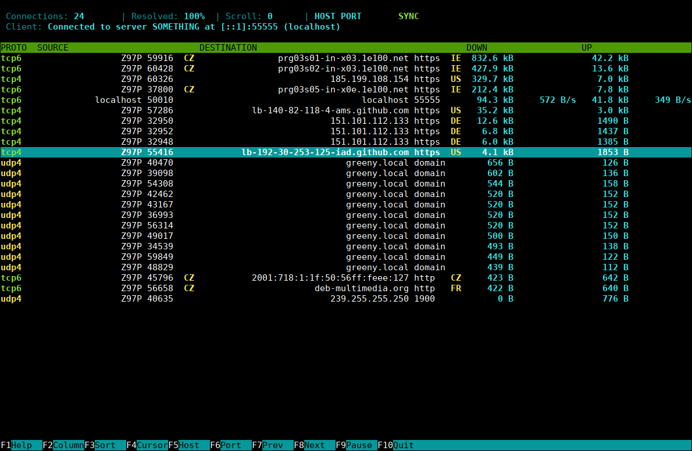
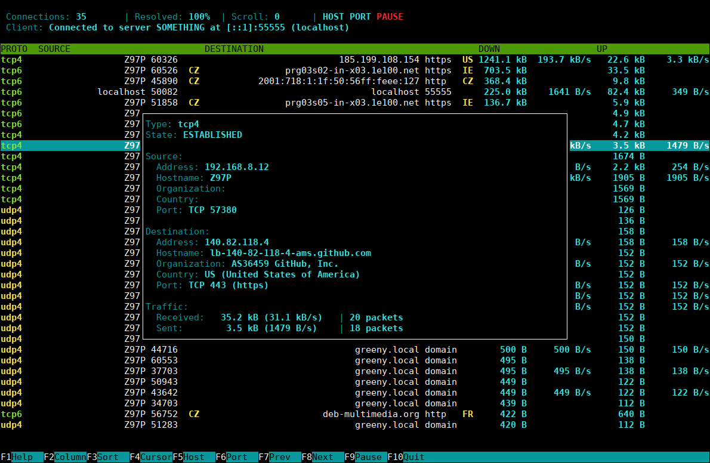

# conntop

ConnTop is an interactive tool for monitoring network traffic in real-time. It allows user to view and examine active connections
on the system. The current version runs only on Linux-based systems, but it's designed as cross-platform tool, so adding support
for other platforms in future should be quite easy. Note that this is a fairly new project without long-term testing, so be
careful when using it in a production environment.





---

### Features

- Optional client-server mode
- Automatically obtains additional information - hostname, ASN, organization, country, service name
- Uses local GeoIP database to quickly obtain AS and country information
- Uses Netfilter connection tracking table (conntrack) to acquire traffic data effectively
- Terminal UI (curses library) with design inspired by [htop](https://github.com/hishamhm/htop)
- Connection list updates can be paused at any time, allowing user to inspect currently active connections in detail
- Configurable connection list columns with sort feature

---

### Build instructions

#### Requirements

To build it, you need CMake, C++14 compiler (GCC >= 5 or Clang >= 3.4), and the following libraries:

- `libnetfilter-conntrack`
- `libmaxminddb`
- `curses`

If you are going to build only dedicated server, `libmaxminddb` and `curses` libraries are not required.

You may also need `git` to obtain the source code from this repository.

On Debian GNU/Linux and its derivatives (Ubuntu, Mint, ...), you can use the following command to install all required tools and
libraries:

```
sudo apt install build-essential cmake git libnetfilter-conntrack-dev libmaxminddb-dev libncurses-dev
```

#### Preparation

Download the source code:

```
git clone https://github.com/ccomrade/conntop
```

You can also manually download zip file with the source code and extract it.

Now create empty build directory and move to it:

```
mkdir conntop-build
cd conntop-build
```

#### Building

Generate build files inside the empty build directory with the following command. At this point you can also set various build
options with `-D<option>=<value>` parameter. See below for list of supported build options.

```
cmake ../conntop
```

If the build files were generated successfully, you can now build the source code:

```
make
```

The resulting `conntop` or `conntopd` executable can be found in the build directory. You can now start using it. If you want to
install it on your system, use the following command:

```
sudo cp conntop /usr/local/bin/
```

To install dedicated server executable, use the following command instead:

```
sudo cp conntopd /usr/local/sbin/
```

#### Build options

- `CONNTOP_DEDICATED`: Set to `1` to build conntop dedicated server (`conntopd`). 
- `CONNTOP_USE_OWN_LIBMAXMINDDB`: Set to `1` if your system doesn't provide `libmaxminddb` library.

Complete list of build options provided by CMake can be found
[here](https://cmake.org/cmake/help/latest/manual/cmake-variables.7.html).

---

### Usage

#### Setup

Check the following steps before using conntop.

##### Netfilter connection tracking

You can skip this step on systems where you want to use only the conntop client.

Linux kernel contains connection tracking table (conntrack) that is used by conntop to acquire traffic data. This table is active
only when something inside the kernel requires it. For example, when stateful firewall is enabled. In older versions of Linux
kernel, it's possible to activate the connection tracking table by loading its kernel modules. This doesn't work anymore since
[kernel version 4.14](https://github.com/torvalds/linux/commit/4d3a57f23dec59f0a2362e63540b2d01b37afe0a).

So, to activate the connection tracking table, you need to enable firewall (or NAT). If firewall is not already enabled on your
system, you can enable it with iptables or preferably with modern [nftables](https://wiki.archlinux.org/index.php/nftables), or
any front-end tool built on top of them. By default, the connection tracking table doesn't provide number of packets and bytes.
To enable it, you need to set the `acct` parameter of the `nf_conntrack` kernel module to `1`. You can do this, for example, by
creating `netfilter.conf` file inside `/etc/modprobe.d/` with the following content:

```
options nf_conntrack acct=1
```

If the connection tracking table is not active, conntop will work but won't be able to obtain any traffic data. Similarly, when
the `acct` parameter is not set to `1`, conntop won't be able to obtain number of received and sent packets and bytes.

##### GeoIP database

You can skip this step on systems where you want to use only the conntop server.

Local GeoIP database is optional and is used to obtain additional information about network addresses. The database is expected in
MaxMind DB binary format, and the following paths are used to search for its files:

```
$HOME/.local/share/GeoIP
/usr/local/share/GeoIP
/var/lib/GeoIP
```

The current version of conntop can use the following database files:

```
GeoLite2-Country.mmdb
GeoLite2-ASN.mmdb
```

To obtain the GeoIP database, [geoipupdate](https://github.com/maxmind/geoipupdate) tool can be used. On Debian GNU/Linux and its
derivatives (Ubuntu, Mint, ...) with enabled contrib packages, you can install it with the following command:

```
sudo apt install geoipupdate
```

It periodically checks and downloads database updates. Don't forget to edit its configuration file `/etc/GeoIP.conf` to enable all
database editions used by conntop.

You can also download the GeoIP database manually from [here](https://dev.maxmind.com/geoip/geoip2/geolite2/).

#### Basic use

To start monitoring network traffic, simply launch conntop as follows:

```
sudo conntop
```

If you are not sure how to control it, press `F1`.

#### Client-server mode

You can also start conntop server and connect to it with conntop client from another computer. This mode is intended to be used
for monitoring network traffic on devices where running whole application is not possible for performance reasons (for example,
small computer used as a router). Server can handle multiple clients at once and it only collects traffic data without resolving
any additional information or doing any connection list operations that can be done on client.

To launch conntop server, use the following command:

```
sudo conntop --server
```

Or use dedicated server:

```
sudo conntopd
```

To specify server listen address, use `--listen=<address>` parameter. You can use this parameter multiple times to specify more
than one listen address. When no listen address is specified, server listens on loopback only. If you want server to listen on
all addresses, use `--listen-any` parameter instead.

Now with server running, you can start client that connects to it:

```
conntop --connect=<server-address>
```

To change port of both client and server, use `--port=<port>` parameter.

#### Other options

To obtain list of all available command line options with short description, use the following command:

```
conntop --help
```

---

### TODO

- [ ] Connection list group mode
- [ ] Connection list ghost mode
- [ ] Integrated WHOIS client
- [ ] Automatically identify and highlight local and other special addresses
- [ ] Resolve process name for local connections
- [ ] Add list with local listening sockets and calculate total traffic for each one
- [ ] Additional protocols (ICMP, SCTP, ...)
- [ ] Network interface statistics mode
- [ ] Add pcap API collector
- [ ] Manual (man page)
- [ ] GUI (probably Qt)
- [ ] Shell autocompletion script
- [ ] Add static build option
- [ ] Add install target rules
- [ ] Add support for multi-collector and multi-UI build
- [ ] Add unit tests for certain classes
- [ ] Windows support + WinAPI GUI
- [ ] Improve client-server protocol message parsing (validate each message against JSON schema during parsing)
- [ ] Prevent rare exit delay caused by resolver thread blocked in some resolve function (timeout takes few seconds)
- [ ] Automatically remove unused addresses and ports on server to save some memory
- [ ] Automatically put server to sleep mode when no client is connected and collector is "dumpable"
- [ ] Create some modern C++ thing to replace designated initializers (non-standard extension in C++)
- [ ] Send modifications of RapidJSON library to upstream (or use another JSON library)
- [ ] Add changelog file

---

### License

This program is free software: you can redistribute it and/or modify
it under the terms of the GNU General Public License as published by
the Free Software Foundation, either version 3 of the License, or
(at your option) any later version.

This program is distributed in the hope that it will be useful,
but WITHOUT ANY WARRANTY; without even the implied warranty of
MERCHANTABILITY or FITNESS FOR A PARTICULAR PURPOSE.  See the
GNU General Public License for more details.

You should have received a copy of the GNU General Public License
along with this program.  If not, see <https://www.gnu.org/licenses/>.
